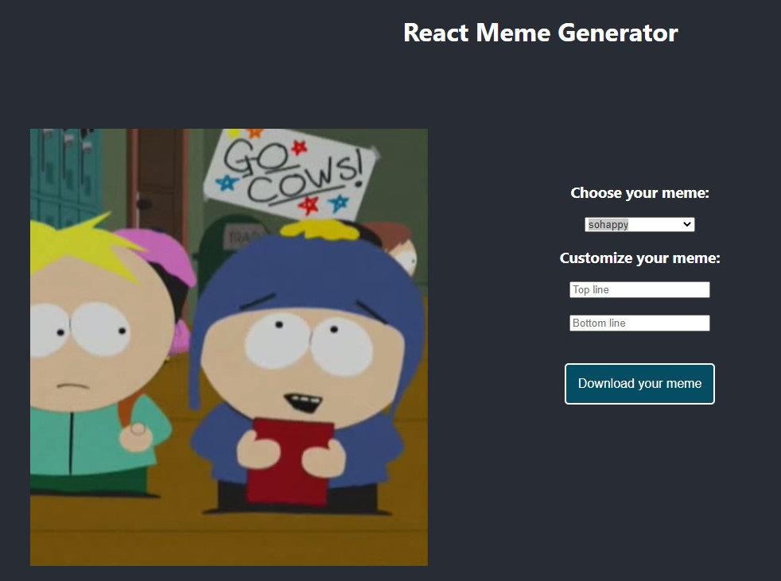

# react-meme-generator

With this React application, you can edit text to a meme from [memegen.link](https://memegen.link/examples) and download it to your computer as a png-file.

Please run `yarn start` to start the application.
